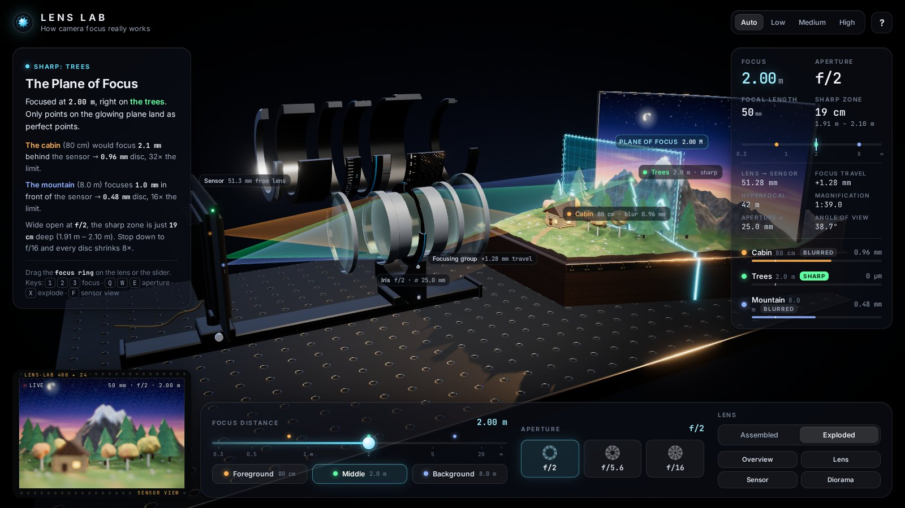
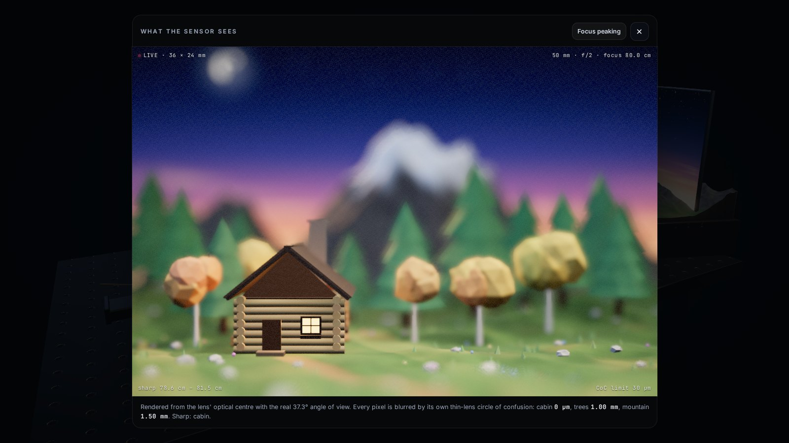

# Lens Lab — how camera focus really works

An interactive 3D optics bench that teaches focus, aperture and depth of field with **real thin-lens physics**. Turn the knurled focus ring of a sectioned 50 mm lens, watch the focusing group travel on its helicoid, see light from a miniature diorama converge — or not — on a camera sensor, and look through the sensor to see the exact blur every object gets.

**Live demo:** https://hazemalhayattrading.github.io/lens-lab/





## What you can do

- **Turn the focus ring** directly in 3D (the grabbed point stays under your finger), use the **30 cm → ∞ slider**, or jump to **Foreground / Middle / Background**.
- **Change the aperture** (f/2, f/5.6, f/16): the 9 iris blades close, the light cones thin out and the sharp zone grows.
- **Assembled ⇄ Exploded**: the barrel lifts away and the six glass elements spread along the axis.
- **Watch the light**: traced ray bundles from the cabin window, a tree tip and the snowy summit pass through every element. The in-focus bundle meets in a point on the sensor; the others land as a disc whose size is the real circle of confusion.
- **Plane of focus** glows inside the diorama (with near/far limits of the sharp zone) and draws a contour wherever it slices through the scene.
- **Sensor view**: a live render from the lens' optical centre with a depth-of-field pass driven by the physics — shown in the filmstrip, projected upside-down on the 3D sensor chip, and enlargeable (with focus peaking).
- Live readouts (focus distance, aperture, focal length, sharp zone in cm, lens→sensor distance, focus travel, hyperfocal distance, magnification, angle of view, per-object blur) and a *Plane of Focus* explanation that rewrites itself as you focus.
- Camera presets (Overview, Lens, Sensor, Diorama), orbit with damping and limits, touch support, responsive layout, quality selector (Auto / Low / Medium / High).

Keyboard: `1` `2` `3` focus presets · `Q` `W` `E` apertures · `X` explode · `F` sensor view · `←` `→` nudge focus · `Esc` close.

## The physics

The lens is modelled as one effective thin lens: **f = 50 mm**, full-frame sensor **36 × 24 mm**, acceptable circle of confusion **c = 0.030 mm**. All numbers shown are computed, not faked (`src/optics/thinLens.ts`):

| Quantity | Formula |
|---|---|
| Thin-lens equation | 1/f = 1/dₒ + 1/dᵢ |
| Focusing travel (unit focusing) | Δ = dᵢ − f = f² / (s − f) — 10 mm at 0.3 m |
| Aperture diameter | A = f / N |
| Hyperfocal distance | H = f² / (N·c) + f |
| Depth-of-field limits | Dₙ = s(H − f) / (H + s − 2f), D_f = s(H − f) / (H − s) (∞ if s ≥ H) |
| Blur disc of an object at d | b = f²·\|d − s\| / (N·(s − f)·d) |
| Angle of view | 2·atan(18 mm / dᵢ) — so focus breathing is real |

- **Focusing** is unit focusing: the ring drives a helicoid (ring angle ∝ Δ, just like a real lens, which is why the engraved distance scale bunches up towards ∞). The fixed barrel even carries a working depth-of-field scale: the travel for the DoF limits is ≈ ±N·c for any distance.
- **Sensor view DoF**: every pixel's depth → physical distance → thin-lens CoC in mm → blur radius in pixels (image width ↔ 36 mm), then a scatter-as-gather bokeh pass with an iris-shaped kernel and proper near/far handling.
- **Scale**: the image side (lens → sensor) is an affine scaling of real millimetres, so "meets in a point" vs. "lands as a disc" is geometrically exact; the object side is compressed with a smooth map so a 30 cm → ∞ scene fits on a workbench. Details and hand-checked numbers are in [PLAN.md](PLAN.md).

The optics are covered by unit tests, including three hand-calculated scenarios (`npm test`).

## Run it locally

Requires Node.js 20.19+ (22 recommended).

```bash
npm install
npm run dev       # → http://localhost:5173/lens-lab/
npm test          # optics unit tests (vitest)
npm run build     # type-check + production build into dist/
npm run preview   # serve the production build → http://localhost:4173/lens-lab/
```

## Deploy (GitHub Pages)

`.github/workflows/deploy.yml` tests, builds and publishes `dist/` on every push to `main` (or manually via *Run workflow*). One-time setup: **Settings → Pages → Build and deployment → Source: GitHub Actions**. Vite's `base` is `/lens-lab/`, matching `https://<user>.github.io/lens-lab/`.

## Project structure

```
src/
  optics/        thin-lens maths, helicoid, depth map, per-frame optics state
  scene/         bench, lights, studio environment, camera rig, sensor stand,
                 lens/ (elements, cutaway barrel, iris, textures), diorama/,
                 rays/ (glow lines + ray-bundle tracer), plane of focus
  render/        main post-processing (bloom, ACES, vignette), sensor DoF pipeline, quality
  ui/            panels, readouts, explanation text, 3D labels
  interaction/   focus-ring dragging
  state/         animated app state
tests/           optics unit tests
```

Everything in the scene — lens, barrel, knurling, engraved scales, PCB, cabin, trees, mountain, sky — is generated procedurally in code; there are no model or texture downloads.

Built with [three.js](https://threejs.org), [postprocessing](https://github.com/pmndrs/postprocessing), Vite and TypeScript. Fonts: Inter and JetBrains Mono (bundled via Fontsource).
