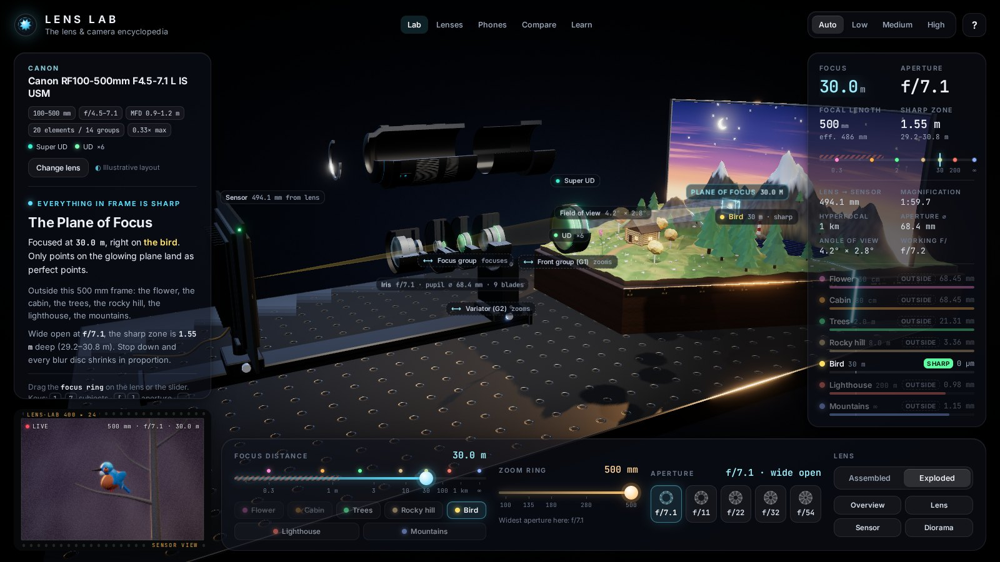
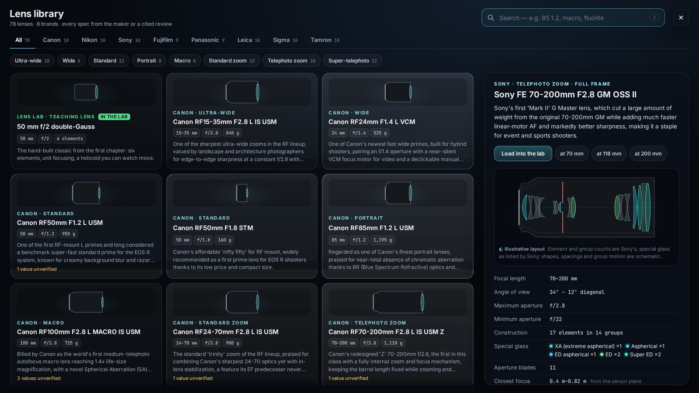
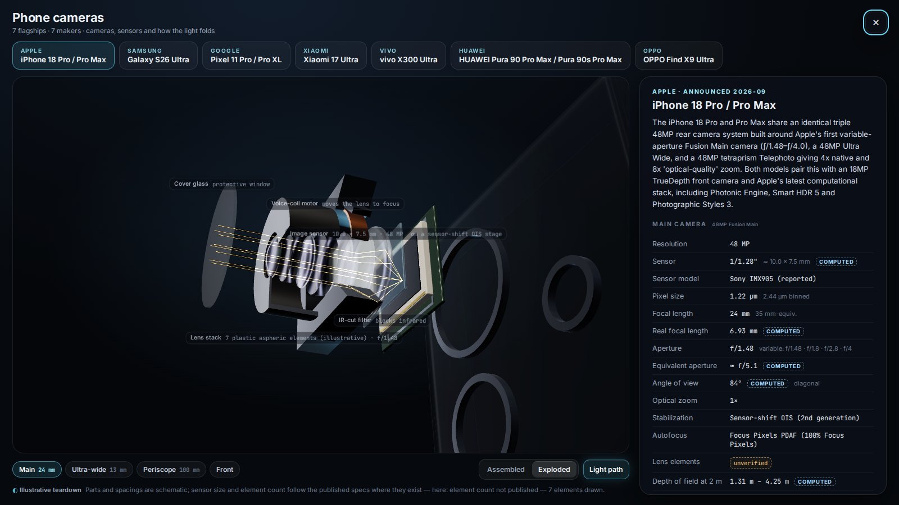
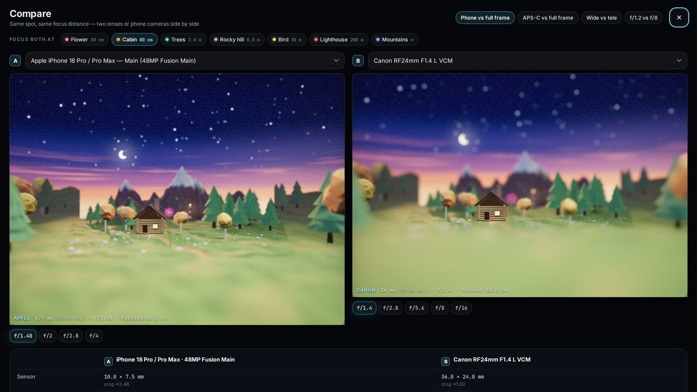
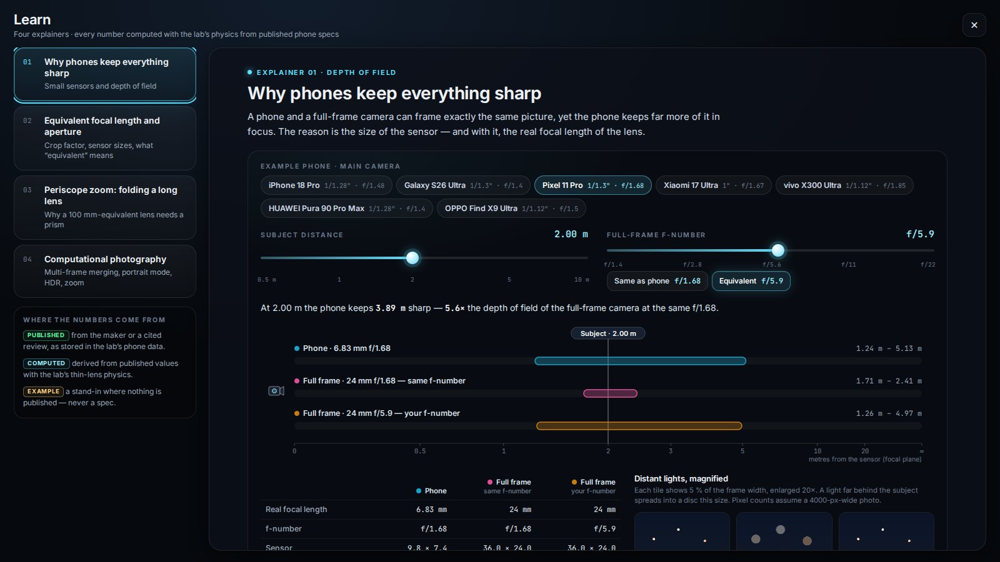
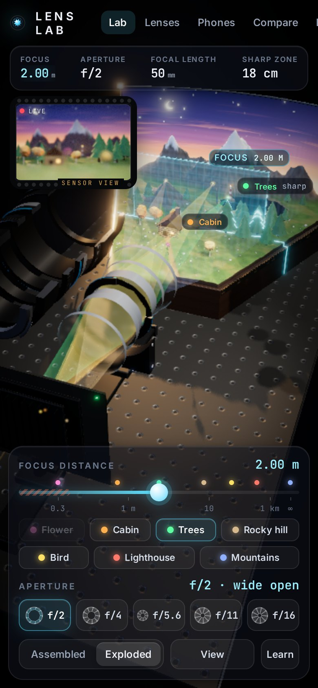
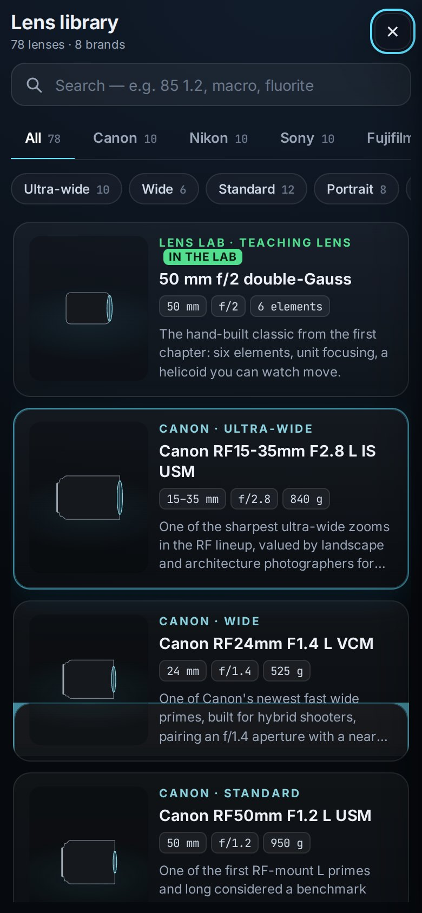
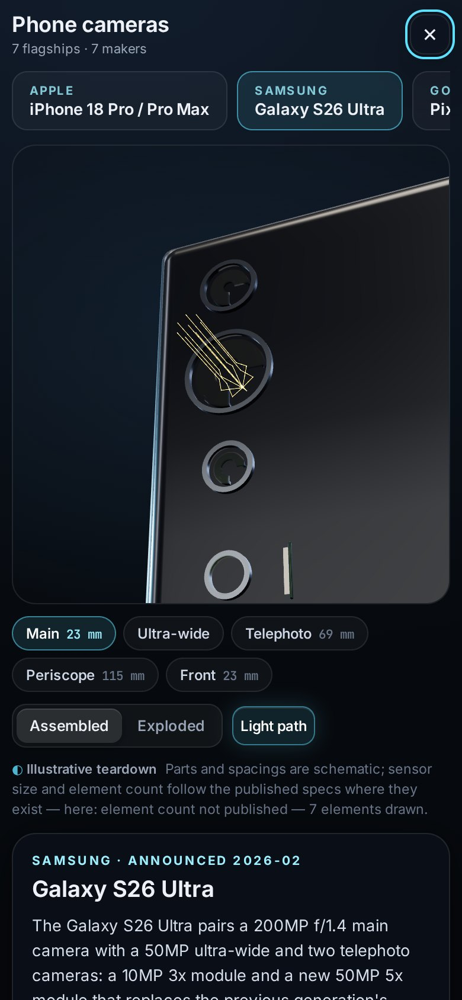

# Lens Lab — a lens and camera encyclopedia you can take apart

An interactive 3D optics bench and encyclopedia. It teaches focus, aperture, zoom and depth of field with **real thin-lens physics**, and lets you load any of **78 real lenses** from eight makers and **7 current flagship phones** into the lab. Turn the focus and zoom rings in 3D. Watch the lens groups move and the light converge on the sensor. Take phone camera modules apart, and compare two lenses or phone cameras side by side.

**Live demo:** https://hazemalhayattrading.github.io/lens-lab/


## Sections

### Lab: the optics bench
- **Turn the focus ring** directly in 3D (the grabbed point stays under your finger), use the slider, or jump to one of seven subjects on a depth ladder:
  - flower 0.3 m, cabin 0.8 m, trees 2 m, hill 8 m;
  - bird 30 m, tower 200 m, peaks at ∞.
- **Zoom lenses** get a working zoom ring. The zoom groups slide, the front tube extends when the real lens does, and the view narrows. A cone shows the angle of view in the scene.
- **Aperture**: the iris has the lens' published blade count. The light cones thin out and the sharp zone grows.
- **Assembled ⇄ exploded**: the barrel lifts away and the groups spread out. The cutaway shows the real element and group counts. Special elements (aspherical, ED/low-dispersion, fluorite, high-index …) are colour-coded and labelled. The layout is marked *illustrative* because the makers' own diagrams are not copied.
- **Watch the light**: ray bundles from three subjects pass through every element. The in-focus bundle meets in a point on the sensor. The others land as a disc whose size is the real circle of confusion.
- **Sensor view**: a live render from the lens, with a depth-of-field pass driven by the physics. It also supports focus peaking.
- **Live readouts**:
  - distance, aperture and focal length, plus the effective focal length while the lens breathes;
  - sharp zone, hyperfocal distance and magnification;
  - angle of view and the blur on each object.

  Values the maker does not publish are marked **unverified**, never guessed.




### Lenses: the library
- **78 lenses** from Canon, Nikon, Sony, Fujifilm, Panasonic, Leica, Sigma and Tamron, 9–10 per maker. They cover wide, standard and portrait primes, ultra-wide, standard and telephoto zooms, super-telephotos and macro lenses. Formats are full frame, APS-C, Micro Four Thirds and medium format.
- **Browsing**: brand tabs, category filters, and a search box over names, specs and features.
- **Each lens card** shows:
  - a cross-section glyph;
  - a detail sheet with every spec, including optical construction, special glass, blade count, closest focus, magnification, filter size, dimensions and weight;
  - a short review summary and the source links.
- **Load into lab** rebuilds the lens procedurally from its real dimensions and swaps it onto the bench.



### Phones: camera modules taken apart
- Seven current flagships:
  - iPhone 18 Pro, Galaxy S26 Ultra, Pixel 11 Pro;
  - Xiaomi 17 Ultra, vivo X300 Ultra, HUAWEI Pura 90 Pro Max, OPPO Find X9 Ultra.
- **Per-camera specs**: sensor format, pixels, equivalent focal length, aperture, OIS and the maker's computational features. Real focal length, equivalent aperture and depth of field are computed and labelled as computed.
- **3D exploded teardown** of each camera module: cover glass, lens stack, IR filter, sensor and voice-coil or OIS parts. Periscope and tetraprism folds show animated light turning through the prism.
- Any phone camera can be put next to a lens in **Compare**.



### Compare
- Two lenses or phone cameras side by side, from the same spot and focused at the same distance: specs, angle of view, depth of field and **two live sensor renders**.
- Presets: phone vs full frame, crop vs full frame, wide vs tele, and aperture.



### Learn: four explainers with live visuals
1. **Why phones keep everything sharp**: small-sensor depth of field, phone vs full frame at the same framing.
2. **Equivalent focal length and aperture**: sensor sizes to scale, plus a calculator.
3. **Periscope zoom**: a to-scale side section of a phone with a straight lens, a one-fold periscope and a four-fold layout.
4. **Computational photography**: multi-frame noise reduction (measured vs √N), portrait mode, HDR and crop zoom.



**On a phone:**

<p>  </p>

**Keyboard** (lab):

| Key | Action |
|---|---|
| `1`–`7` | subjects |
| `[` `]` | aperture |
| `-` `=` | zoom |
| `X` | explode |
| `F` | sensor view |
| `←` `→` | nudge focus |
| `L` | Lenses |
| `P` | Phones |
| `C` | Compare |
| `E` | Learn |
| `Esc` | close |

**Deep links**: `#lenses/<lens-id>`, `#phones/<phone-id>`, `#compare/<preset>`, `#learn/<topic>`.

## Data and accuracy

Every product was researched on the web, the maker's official pages first and reviews only to fill gaps. Each product stores its source URLs. [data/SOURCES.md](data/SOURCES.md) lists every lens and phone with its sources and the date they were checked.

**No spec is invented.** A value that could not be verified is stored as `null` and shown as *unverified* in the UI. Values the app derives, such as real focal length, equivalent aperture, depth of field or a phone camera's angle of view, are tagged *computed*. The rest are tagged *published*.

Brand and product names appear as text only. There are no logos, trademark graphics or product photos. Every lens, phone and scene object is generated procedurally in code.

## The physics

Each lens is modelled as a thin lens with its published focal range, maximum aperture (constant or variable), minimum aperture and closest focus. Distances are measured from the focal plane, like the distance scale on a real lens. The circle of confusion is c = sensor diagonal / 1442 (0.030 mm on full frame), and phone optical formats use 1/x" ≈ 16/x mm diagonal at 4:3. Implementation: `src/optics/`, `src/lab/`.

| Quantity | Formula |
|---|---|
| Thin-lens equation | 1/f = 1/u + 1/v, with focus distance T = u + v |
| Aperture diameter | A = f / N |
| Hyperfocal distance | H = f² / (N·c) + f |
| Depth-of-field limits | Dₙ = u(H − f)/(H + u − 2f), D_f = u(H − f)/(H − u) (∞ if u ≥ H) |
| Blur disc of an object at d | b = f²·\|d − u\| / (N·(u − f)·d) |
| Crop and equivalence | crop = 43.27 mm / diagonal; f_eq = f·crop, N_eq = N·crop |
| Angle of view | 2·atan(diagonal / 2v) |

- **Focus breathing**: the closest focus and maximum magnification are both published, and the effective focal length is fitted to match them. Internal-focus lenses therefore breathe the way the real lens does.
- **Illustrative optical layouts** (`src/lab/opticalLayout.ts`) are built per design family (double-Gauss, retrofocus wide, telephoto, zooms …).
  - Hard constraints: the element count is always the published one; cemented doublets make the group count match; surfaces never overlap at any zoom or focus position.
  - The zoom and focus groups move along the axis, and the barrel is scaled from the lens' real diameter and length.
- **Sensor view DoF**:
  - every pixel's depth → physical distance → circle of confusion in mm → blur radius in pixels;
  - a three-layer scatter-as-gather bokeh pass with an iris-shaped kernel.
- **Scale**: the image side is real millimetres, so "meets in a point" vs "lands as a disc" is geometrically exact. The object side is compressed with a smooth map so 0.3 m → ∞ fits on a workbench.

The optics, layouts, phone optics and explainers are covered by unit tests with hand calculations (`npm test`). The worked numbers are in [PLAN.md](PLAN.md) under "Verification".

## Run it locally

Requires Node.js 20.19+ (22 recommended).

```bash
npm install
npm run dev       # → http://localhost:5173/lens-lab/
npm test          # unit tests (vitest)
npm run build     # type-check + production build into dist/
npm run preview   # serve the production build → http://localhost:4173/lens-lab/
npm run sources   # regenerate data/SOURCES.md from the data files
```

The library, phones, compare and learn views are lazy-loaded, along with their data and 3D models. The first load only fetches the lab.

## Deploy (GitHub Pages)

`.github/workflows/deploy.yml` tests, builds and publishes `dist/` on every push to `main`, or manually via *Run workflow*. One-time setup: **Settings → Pages → Build and deployment → Source: GitHub Actions**. Vite's `base` is `/lens-lab/`, matching `https://<user>.github.io/lens-lab/`.

## Project structure

```
data/
  lenses/*.json  researched lens data, one file per maker (specs + sources)
  phones/*.json  researched phone data
  SOURCES.md     every product with its sources and check date
src/
  optics/        thin-lens maths, formats, lens model, helicoid, depth map
  lab/           library lens → lab lens, illustrative optical layouts, special glass, phone lenses
  scene/         bench, lights, camera rig, sensor stand, FOV cone, plane of focus,
                 lens/ (procedural lens, teaching lens, iris, textures), diorama/, rays/
  render/        main post-processing, sensor DoF pipeline, quality
  phone/         phone camera optics, procedural exploded module viewer
  learn/         explainer physics, noise simulation, fold geometry, topics/
  ui/            lab UI, library, phones, compare, learn views, formatters
  state/         animated app state
tests/           unit tests with hand calculations
```

Built with [three.js](https://threejs.org), [postprocessing](https://github.com/pmndrs/postprocessing), Vite and TypeScript. Fonts: Inter and JetBrains Mono (bundled via Fontsource).
